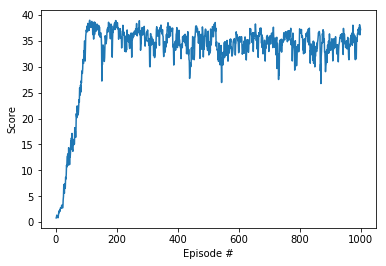

# Report

In this project, the learning algorithm of deep deterministic policy gradient(DDPG) has been implemented to solve the control problem of  double-jointed arm. The DDPG algoritm is good at tackling reinforcement-learning problem with continuous state spaces and continuous action spaces.

## DDPG

### Neural Network Architecture

##### Actor

- Input Layer: 33
- Fully connected Layer 1: 256 (with relu as activation function)
- Fully connected Layer 2: 128 (with relu as activation function)
- Output Layer: 4

##### Critic

- Input Layer: 33
- Fully connected Layer 1: 256(hidden layer) + 4(action) (with relu as activation function)
- Fully connected Layer 2: 128 (with relu as activation function)
- Output Layer: 1

### Hyper-parameters

- Replay Memory Size = 1e6
- Batch Size = 512
- GAMMA = 0.99
- TAU of Soft Updating = 1e-3
- Learning Rate of Actor Network = 1e-4
- Learning Rate of Critic Network = 1e-3
- Learning Timesteps = 5
- Multi Learning Times = 5

Both of the actor and the critic network is updated `Multi Learning Times` after every `Learning Timesteps`.

### Plot of Rewards

DDPG solved the problem in 100 episodes.

## Future Improvement

- Fine tuning hyper parameters to get better performance
- Using prioritized experience replay may be also useful to improve efficiency of the DDPG algorithm
